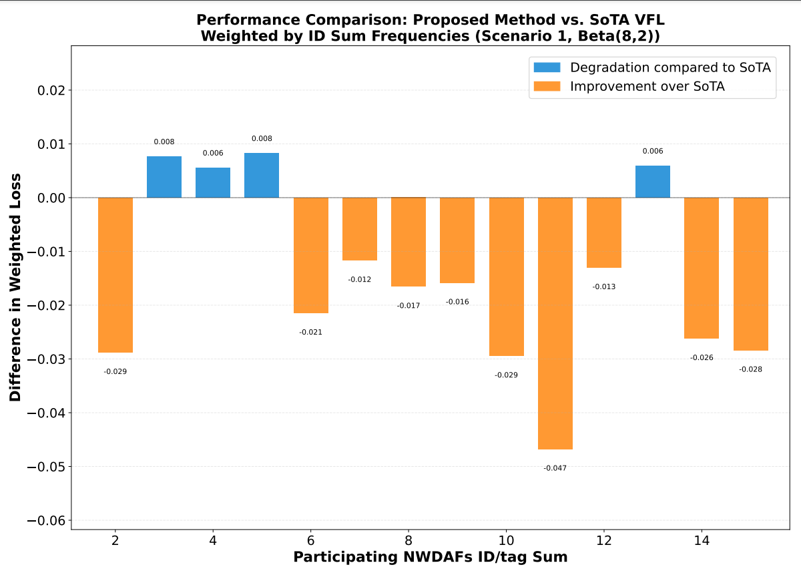

# Vertical Federated Learning

This example will showcase how Vertical Federated Learning can be performed using our framework which built over the Flower Framework which only supports Horizental Federated learning (HFL) at the moment [(link)](https://flower.ai/). We'll be using the [dashing factor v2 dataset](https://merce-gitlab.fr-merce.mee.com/gitlab/dashing_factory_2.0/dashing_factory_2.0_ns3)
to train simple regression models to estimate the QoE of an AGV based on other available distributed features (check the data collection implementation at [dashing factor v2 dataset](https://merce-gitlab.fr-merce.mee.com/gitlab/dashing_factory_2.0/dashing_factory_2.0_ns3)). The main idea of Vertical Federated Learning is that each client -- in contrast to horizental Federated Learning -- is endued with different feature spaces but share the same sample space, and the server holds the ground truth labels of the dataset.

## Project Setup and Installing Dependencies

Start by cloning the example project and installing the dependencies using the `requirements.txt` file.


## Explanations

### Vertical FL vs Horizontal FL

|                       | Horizontal Federated Learning (HFL or just FL)                                                                                                                                                           | Vertical Federated Learning (VFL)                                                                                                                                                                                                                                                                                                                                        |
| --------------------- | -------------------------------------------------------------------------------------------------------------------------------------------------------------------------------------------------------- | ------------------------------------------------------------------------------------------------------------------------------------------------------------------------------------------------------------------------------------------------------------------------------------------------------------------------------------------------------------------------ |
| Data Distribution     | Clients have different data instances but share the same feature space.  Think of different hospitals having different patients' data (samples)  but recording the same types of information (features). | Each client holds different features for the same instances.  Imagine different institutions holding various tests or  measurements for the same group of patients.                                                                                                                                                                                                      |
| Model Training        | Each client trains a model on their local data,  which contains all the feature columns for its samples.                                                                                                 | Clients train models on their respective features without  having access to the complete feature set.  Each model only sees a vertical slice of the data (hence the name 'Vertical').                                                                                                                                                                                    |
| Aggregation           | The server aggregates these local models by averaging  the parameters or gradients to update a global model.                                                                                             | The server aggregates the updates such as gradients or parameters,  which are then used to update the global model.  However, since each client sees only a part of the features,  the server typically has a more complex role,  sometimes needing to coordinate more sophisticated aggregation strategies  that may involve secure multi-party computation techniques. |
| Privacy Consideration | The raw data stays on the client's side, only model updates are shared,  which helps in maintaining privacy.                                                                                             | VFL is designed to ensure that no participant can access  the complete feature set of any sample,  thereby preserving the privacy of data.                                                                                                                                                                                                                               |


## Data

The dashing factor v2 dataset  is  used to predict the QoE of the AGV based on other `physical`, `mac` and `application` layer features.


The data is stored as a feathers file in `final_raw_dataset_refined_tested.csv`. Post-processing, the dataset contains ~6500 samples with their corresponding labels.

#### Preprocessing

In `task.py`, you'll find the preprocessing functions we'll apply to our data:

The pre-processing functions are used to refine the features, pick the label (which we wish to predict), and distribute the features among a number of clients that you wish to use.

To refine the features, normalization function is used :


  ```python
def min_max_scaling(column):
    min_val = column.min()
    max_val = column.max()
    return (column - min_val) / (max_val - min_val)
  ```

#### Partitioning

In `task.py`, we  partition the data for our "num_clients" clients to mirror real clients where different organizations hold different feature sets. Moreover, we omit useless features from the original dataset and assign the relevant ground truth labels to the label column defined in the `params.yaml` file:

```python

def get_partitions_and_label(params=None, run_id=0,device=None):
    path = params.get("simulation").get("path")
    X, y_label = get_processed_data(path, params)

    # Generate features and partition data
    processed_df, all_keywords = _create_features(X)
    raw_partitions, reliability = _partition_data(processed_df, all_keywords, params, y_label, run_id)

    # Split data into train and test sets
    partitions, partitions_test = zip(*[train_test_split(partition, test_size=0.1, random_state=RANDOM_SEED)
                                        for partition in raw_partitions])
    
    partitions, partitions_test = list(partitions), list(partitions_test)  # Convert tuples to lists

    print(f"ylabel is {y_label}")

    # Extract y_label from the first partition only (since it's the same across all)
    if y_label in partitions[0].columns:
        train_ground = partitions[0][y_label].values
        test_ground = partitions_test[0][y_label].values
    else:
        raise ValueError(f"y_label '{y_label}' not found in the first partition!")

    # Drop y_label from all partitions
    for partition in partitions:
        partition.drop(columns=[y_label], inplace=True, errors="ignore")
    for partition in partitions_test:
        partition.drop(columns=[y_label], inplace=True, errors="ignore")

    # Verify if y_label is still present
    remaining_columns = [
        i for i, partition in enumerate(partitions) if y_label in partition.columns
    ] + [
        i + len(partitions) for i, partition in enumerate(partitions_test) if y_label in partition.columns
    ]

    if remaining_columns:
        print(f" Warning: y_label '{y_label}' is still present in partitions {remaining_columns}!")


    partitions = [normalize_features(partition) for partition in partitions]
    partitions_test = [normalize_features(partition) for partition in partitions_test]

    print(f"partitions shape = {[np.shape(p) for p in partitions]}")

    return partitions, partitions_test, train_ground, test_ground, len(partitions), reliability


def _partition_data(df, all_keywords, params, y_label, run_id):
    initial_n_clusters = params.get('simulation').get('num_clients') 
    min_feature_per_client = 4 
    if params.get('simulation').get('Optimized'):
        print("*******************************************Optimized Assignment*******************************************")
        clusters, client_reliability, _  = vfl_feature_distribution(df, df[y_label],y_label, initial_n_clusters, min_feature_per_client, run_id=run_id, use_saved=False, save_dir="reliability_lists")
    else:
        print("*******************************************Random Assignment*******************************************")
        clusters, client_reliability = random_feature_distribution(df, initial_n_clusters, min_feature_per_client, run_id=run_id, use_saved=True, save_dir="reliability_lists")


    partitions = []
    
    keywords_sets = clusters
    
    for keywords in keywords_sets:
        selected_columns = set(keywords)  # Only include assigned features
        if y_label in df.columns:
            selected_columns.add(y_label)  # Ensure y_label is included
        
        partitions.append(df[list(selected_columns)])
  
    
    # Check for intersection of features across partitions (except y_label)
    all_features = [set(part.columns) - {y_label} for part in partitions]
    for i in range(len(all_features)):
        for j in range(i + 1, len(all_features)):
            intersection = all_features[i] & all_features[j]
            if intersection:
                raise ValueError(f"Feature overlap detected between partitions {i} and {j}: {intersection}")
    
    return partitions, client_reliability

```

#### The partitioning makes use of two possible feature distribution strategies, one is random, which distributes the features randomly among (n_clusters= num_clients):

```python
def random_feature_distribution(X, n_clusters, min_feature_per_client, run_id, use_saved=False, save_dir="reliability_lists"):
    """Randomly distribute features into clusters without duplication."""
    if not os.path.exists(save_dir):
        os.makedirs(save_dir)
    
    filename = f"client_reliability_{run_id}.pkl" if run_id is not None else "client_reliability_default.pkl"
    filepath = os.path.join(save_dir, filename)
    
    if use_saved and os.path.exists(filepath):
        with open(filepath, 'rb') as f:
            client_reliability = pickle.load(f)
        print(f"Loaded reliability list for run {run_id}: {client_reliability}")
    else:
        client_reliability = list(np.random.rand(n_clusters))  # Generate reliability list with n_clusters elements
        print(f"Generated new reliability list for run {run_id}: {client_reliability}")
        
        with open(filepath, 'wb') as f:
            pickle.dump(client_reliability, f)
        print(f"Saved reliability list to {filepath}")
    
    features = list(X.columns)
    print(f"len features = {len(features)}")
    np.random.shuffle(features)
    print(f'Reliability of users = {client_reliability}')
    
    total_features = len(features)
    min_required_features = n_clusters * min_feature_per_client
    
    if total_features < min_required_features:
        raise ValueError(f"Not enough features ({total_features}) to ensure at least {min_feature_per_client} per client")
    
    cluster_sizes = np.full(n_clusters, min_feature_per_client)
    extra_features = total_features - min_required_features
    
    for i in range(extra_features):
        cluster_sizes[i % n_clusters] += 1  # Distribute extra features evenly without out-of-bounds error
    
    clusters = []
    start = 0
    for size in cluster_sizes:
        clusters.append(features[start:start + size])  # Ensure unique feature assignment
        start += size
    
    # Verify no duplicate features across clusters
    seen_features = set()
    for cluster in clusters:
        for feature in cluster:
            if feature in seen_features:
                raise ValueError(f"Feature duplication detected: {feature}")
            seen_features.add(feature)
    
    return clusters, client_reliability
```

The second strategy distributes features in a way, such that each client holds a set of features of importance equivelant to its relative reliability compared to the other clients. The feature importance are calculated centrally using a Decision Tree Regressor or can be via Mutual Information analysis (MI). We call this strategy "vfl_feature_distribution":
```python
def vfl_feature_distribution(X, y,y_label, n_clients, min_features_per_client=5,run_id=None, use_saved=False, save_dir="reliability_lists"):
    """
    Distribute features to clients based on PCA importance for VFL.
    
    Args:
    X (pd.DataFrame): The input features.
    y (pd.Series): The target variable.
    n_clients (int): Number of clients.
    min_features_per_client (int): Minimum number of features per client.
    
    Returns:
    tuple: (client_features, client_scores)
    
    """

    if not os.path.exists(save_dir):
        os.makedirs(save_dir)


    filename = f"client_reliability_{run_id}.pkl" if run_id is not None else f"client_reliability_default.pkl"
    filepath = os.path.join(save_dir, filename)

    if use_saved and os.path.exists(filepath):
        with open(filepath, 'rb') as f:
            client_reliability = pickle.load(f)
        print(f"Loaded reliability list for run {run_id}: {client_reliability}")
    else:
        # Generate new reliability list
        alpha = 8
        beta = 2
        client_reliability = list(np.random.beta(alpha, beta, size=n_clients))
        print(f"Generated new reliability list for run {run_id}: {client_reliability}")
        
        with open(filepath, 'wb') as f:
            pickle.dump(client_reliability, f)
        print(f"Saved reliability list to {filepath}")
        
    
    # Calculate feature importance
    model = RandomForestRegressor()
    # Assuming y_label is the name of the column we want to exclude
    X_without_y_label = X.drop(columns = y_label)
    features = list(X_without_y_label.columns)
    model.fit(X_without_y_label, y)
    # feature_importance = calculate_group_mi(features, X_without_y_label, y)


    feature_importance = model.feature_importances_
    importance_df = pd.DataFrame({'Feature': X_without_y_label.columns, 'Importance': feature_importance})

    # Add y_label with importance = 0
    importance_df = pd.concat([importance_df, pd.DataFrame({'Feature': y_label, 'Importance': [0]})], ignore_index=True)
    # importance_df = importance_df.sort_values(by='Importance', ascending=False)
    print(f"feature _ importance : {importance_df}")
    # Partition features
    print(f'reliability of users = {client_reliability}') 
    client_features = partition_features(features,feature_importance, n_clients,client_reliability, min_features_per_client)
    
    
    return client_features, client_reliability, None 
```
## Models

### Clients Model Class

Each client's model is a neural network designed to operate on a distinct subset
of features held. In this example we use the following local models class : 


```python
class ClientModel(nn.Module):
    def __init__(self, input_size, latent_dim):
        super(ClientModel, self).__init__()
        
        # Encoder without residual connections and no biases
        self.encoder1 = nn.Sequential(
            nn.Linear(input_size, 64, bias=False),
            nn.SELU(),
        )
        
        self.encoder2 = nn.Sequential(
            nn.Linear(64, 32, bias=False),
            nn.SELU(),
        )
        
        self.encoder3 = nn.Sequential(
            nn.Linear(32, 16, bias=False),
            nn.SELU(),
        )
        
        self.latent_projection = nn.Sequential(
            nn.Linear(16, latent_dim, bias=False),
        )
        
        # Initialize weights
        self.apply(self._init_weights)
        
    def _init_weights(self, module):
        if isinstance(module, nn.Linear):
            torch.nn.init.kaiming_normal_(module.weight, nonlinearity='linear')  # Kaiming Normal 
            if module.bias is not None:
                torch.nn.init.zeros_(module.bias)  
    
    
    def forward(self, x):
        if not torch.is_tensor(x):
            x = torch.tensor(x, dtype=torch.float32)
        if x.dim() == 1:
            x = x.unsqueeze(0)
            
        e1 = self.encoder1(x)
        e2 = self.encoder2(e1)
        e3 = self.encoder3(e2)
        latent = self.latent_projection(e3)
        
        return latent

```

The `input_size` corresponds to the number of features each client is allocated, and this
model maps those features to a "latent_dim"-dimensional latent space. The outputs are essentially feature embeddings that capture the patterns within each client's data slice. These embeddings are then ready to be sent to the server for further
processing.

## Server Model Class

The server's model acts as the central aggregator in the VFL system. It's also a
neural network but with a slightly different architecture tailored to its role
in aggregating the client models' outputs.

```python
class ServerModel(nn.Module):
    def __init__(self, input_size):
        super(ServerModel, self).__init__()
        
        # Wider network with no biases
        self.layer1 = nn.Sequential(
            nn.Linear(input_size, 64, bias=False),
            nn.SELU(),

        )
        
        self.layer2 = nn.Sequential(
            nn.Linear(64, 32, bias=False),
            nn.SELU(),
        )
        
        self.layer3 = nn.Sequential(
            nn.Linear(32, 16, bias=False),
            nn.SELU(),
        )
        
        self.output = nn.Sequential(
            nn.Linear(16, 4, bias=False),
            nn.SELU(),
            nn.Linear(4, 1, bias=False)
        )
        
        self.apply(self._init_weights)
    def _init_weights(self, module):
        if isinstance(module, nn.Linear):
            torch.nn.init.kaiming_normal_(module.weight, nonlinearity='linear')  # Kaiming Normal
            if module.bias is not None:
                torch.nn.init.zeros_(module.bias)  # Bias initialized
    
    
    def forward(self, x):
        if not torch.is_tensor(x):
            x = torch.tensor(x, dtype=torch.float32)
        if x.dim() == 1:
            x = x.unsqueeze(0)
            
        x1 = self.layer1(x)
        x2 = self.layer2(x1)
        x3 = self.layer3(x2)
        return self.output(x3)
```

It comprises multiple linear layers that accepts the concatenated outputs from
all client models as its input. The number of inputs to this layer equals the
total number of outputs from the client models (num_clients x latent_dim). After processing
these inputs, the final layer's output is the QoE point prediction.

## Strategy

The strategy we will write to perform the aggregation will is inherited from `FedAvg` flwr strategy. It constitutes the playground of the server functions. 

```python
self.model = ServerModel(sum(self.latent_dim))


self.initial_parameters = ndarrays_to_parameters(
    [val.cpu().numpy() for _, val in self.model.state_dict().items()]
)

self.optimizer = optim.Adam(self.model.parameters(), lr=0.05)
self.scheduler = optim.lr_scheduler.ExponentialLR(self.optimizer, gamma=0.99)  # 0.5% decay
self.criterion = nn.HuberLoss(reduction='mean',delta=1.5)
self.label = torch.tensor(labels).float().unsqueeze(1)
self.best_model = [param.detach().clone() for param in self.model.parameters()]
```

With `labels` (test and train) and `latent_dim` are given as an argument to the strategy.

We then redefine the `aggregate_fit` method:

```python
def aggregate_fit(
    self,
    rnd,
    results,
    failures,):


        torch.cuda.empty_cache() if torch.cuda.is_available() else None
        # Do not aggregate if there are failures and failures are not accepted
        if not self.accept_failures and failures:
            return None, {}

        embedding_results = [
            torch.from_numpy(parameters_to_ndarrays(fit_res.parameters)[0])
            for _, fit_res in results
        ]

        availability = [
            torch.from_numpy(parameters_to_ndarrays(fit_res.parameters)[1])
            for _, fit_res in results
        ]
        
        order = [
            torch.from_numpy(parameters_to_ndarrays(fit_res.parameters)[2])
            for _, fit_res in results
        ]

        embeddings_aggregated = concatenate_embeddings_by_client_order(embedding_results, order)
        
        total_availability = sum(availability)
        

        embedding_server = embeddings_aggregated.detach().requires_grad_()
        output = self.model(embedding_server)
        
        task_loss = self.criterion(output, self.label)
        

        
        loss_train = task_loss 
        
        if total_availability > 0:
            print(f"availability = {availability}")
            
            self.optimizer.zero_grad()
            
            loss_train.backward()
            
            self.optimizer.step()
            self.scheduler.step()
            
            grads = embedding_server.grad.split(list(self.latent_dim), dim=1)
            np_grads = [grad.detach().cpu().numpy() for grad in grads]
            parameters_aggregated = ndarrays_to_parameters(np_grads)
            del grads

        else:
            print("All clients Failed, failure to update model")
            
            # No need to compute gradients when all clients failed
            with torch.no_grad():
                zero_grads = [torch.zeros_like(embed).cpu().numpy() 
                            for embed in embedding_server.split(list(self.latent_dim), dim=1)]
                parameters_aggregated = ndarrays_to_parameters(zero_grads)
                del zero_grads

        
        self.training_loss.append(task_loss.item())  # Store scalar value, not tensor
        
        metrics_aggregated = {
            "loss_train": task_loss.item(),
            "total_loss": loss_train.item(),
            "available_clients": total_availability
        }
        
        del embedding_server
        del embeddings_aggregated
        del embedding_results
        
        if rnd == self.n_rounds:
            results_dir = Path("_static/results")
            results_dir.mkdir(exist_ok=True)
            if self.optimized:
                np.save(str(results_dir / f"train_results_optimized_{self.n_run}.npy"), self.training_loss)
            else:
                np.save(str(results_dir / f"train_results_not_optimized_{self.n_run}.npy"), self.training_loss)
        
        return parameters_aggregated, metrics_aggregated
    

```

<!-- The aggregate fit is a function responsible of dealing with the embeddings that are received by the clients at each round. Alongside the embeddings, the clients send their ID so that the server concatenate the embeddings in the correct order regardless of the order of transmission and reception of the embeddings by the clients and the server respectively. This function is run by the server during training to perform the forward pass. 
The embeddings received as `np.array`s are first transformed into `tensor`s, before concatenating the "n_clients" embeddings
together. This means that we go from "n_clients" tensors of size `(5067, latent_dim)` to 1 tensor of
size `(5067, latent_dim*num_clients)`. The combined embeddings are then fed through the server model to
get the prediction output. The loss between the predicted label and the ground truth
labels is calculated. Backward propagation is then performed to calculate the
gradients, which are used to update the server model's parameters.

The optimizer updates the server model's parameters based on the calculated
gradients, and the gradients are reset to zero to prepare for the next round of aggregation.

The gradients from the server model's embedding layer are then split according
to the size of the output from each client model (assuming equal size for
simplicity here), ready to be sent back to the respective client models.

**Note again the difference w.r.t HFL:** Here the `aggregate_fit` function returns gradients instead of trained
weights (in contrast to horizental fl case where the server returns the global model weights to clients). This is because, in this setting, sharing gradients allows each
participant to benefit from the collective feedback gathered from the entire
pool of data without the need to align their different feature spaces.

Accordingly, returning `parameters` from the server isn't necessary. However, as said earlier, the server needs to send `gradients` back to clients for them to continue backpropagation and update their local models.
The `Flower` framework's design allows us to use the `aggregate_fit` function for this purpose. Typically, the output of `aggregate_fit` is sent to `Client.evaluate`. We exploit this mechanism by returning gradients instead of `parameters` from `aggregate_fit`.
Consequently, these gradients are transmitted to `Client.evaluate` as if they were `parameters`. This approach explains why we can access gradients from the `parameters` argument in the `Client.evaluate` function, which will be discussed in the next section.

The last thing we have to do is to redefine the `aggregate_evaluate` and `Client.evaluate` functions to
allow distributed evaluation. Initially, flower framework doesnt allow this as its built with HFL in mind. Since the clients here do not hold any labels to compute the test loss locally as in HFL, the clients should use their test data to produce the test embeddings, and then send them to the server so that it can compute the test loss. To allow this kind of communication between the client and the server during evaluation, we tweak the `aggregate_evaluate` and `Client.evaluate` functions to enable clients to trasmit (using `Client.evaluate` function) their test embeddings (via their test data) to the server which is now able to receive those embeddings (via the tweaked `aggregate_evaluate` function) to calculate the test loss during training. -->

##  Overview
The `aggregate_fit`  aggregates embedding results from multiple clients, performs model training on the server, and prepares gradients to be sent back to clients.


The function serves the following purposes:
- **Aggregates embedding results from multiple clients**
- **Conducts model training on the server side**
- **Computes and distributes gradients back to clients**


## Key Components

### 1. Memory Management
- Clears **CUDA cache** at the beginning to prevent memory issues from previous rounds
- Explicitly cleans up **tensors** at the end to free memory

### 2. Client Results Processing
- Converts **client parameters** to PyTorch tensors
- Extracts three key elements from each client's results:
  - **Embeddings**: Feature representations
  - **Availability Information**: Determines active clients
  - **Order Information**: Maintains correct concatenation order

### 3. Embedding Aggregation
- Uses custom function `concatenate_embeddings_by_client_order` to ensure correct order
- Prevents misalignment of embeddings due to transmission order variations

### 4. Model Training
- Feeds **aggregated embeddings** into the server model
- Computes **task loss** using the provided criterion and labels
- Performs **backpropagation only if clients are available**

### 5. Gradient Computation and Distribution
- **When clients are available:**
  - Performs **backpropagation** to compute gradients
  - Updates **model parameters** using an optimizer and scheduler
  - Splits **gradients per client** based on latent dimensions
- **When all clients fail:**
  - Generates **zero gradients** as placeholders

### 6. Metrics Tracking
- Records **loss values** to monitor training progress
- Tracks **client availability**

### 7. Results Saving
- Saves **training results to disk at the final round**
- Handles results differently based on whether **optimization** was used


### Special VFL Adaptation
This function implements a unique approach to federated learning:
- Instead of returning **updated weights** (as in horizontal federated learning), it returns **gradients**
- Leverages the **Flower framework** by sending gradients as if they were parameters
- Enables clients to perform **local weight updates based on server-side feedback**
- Supports a **Vertical Federated Learning setup**, where different participants hold **different features of the same samples** (unlike traditional horizontal FL where clients hold **same features across different samples**)


```python
    def aggregate_evaluate(
    self,
    server_round,
    results,
    failures):
        self.best = 1
    
        availability_ = []
        order_ = []
        embeddings = []
        for _,j in results:
            embeddings.append(torch.tensor(np.array(json.loads(j.metrics["params"])),dtype=torch.float32))
            availability_.append(j.metrics["availability"])
            order_.append(j.metrics["id"])
        print("test clients availability")
        
        print(f"order = {order_}, availability_ = {availability_}, sum = {sum(availability_)}")
        self.power.append(sum(availability_))
        embedding=concatenate_embeddings_by_client_order(embeddings,order_)
        # embedding=torch.cat(embeddings, dim=1)
        with torch.no_grad(): 
            outputs = self.model(embedding)
            loss_test = self.criterion(torch.squeeze(outputs), torch.Tensor(self.test_label))
        if server_round == 1 or self.min_loss > loss_test.item():
            print(f"self.min_loss = {self.min_loss}")
            torch.save([param.detach().clone() for param in self.model.parameters()],f"model_weights_optimized={self.optimized}_server_{self.n_run}.pth")
            self.best = 0
            self.min_loss = loss_test.item()
        test_loss = {"loss_test": loss_test}
        print(f"test loss = {loss_test}")
        self.test_loss.append(loss_test)
        if server_round == self.n_rounds:
            results_dir = Path("_static/results")
            results_dir.mkdir(exist_ok=True)
            if self.optimized == True:

                np.save(str(results_dir / f"test_results_optimized_{self.n_run}.npy"), self.test_loss)
                np.save(str(results_dir / f"power_results_optimized_{self.n_run}.npy"), self.power)
            else:
                np.save(str(results_dir / f"test_results_not_optimized_{self.n_run}.npy"), self.test_loss)
                np.save(str(results_dir / f"power_results_not_optimized_{self.n_run}.npy"), self.power)
        return   test_loss, {} 
        
```

### Overview
The `aggregate_evaluate` method is responsible for handling the evaluation process. It processes client-provided test embeddings, evaluates model performance on the server side, and tracks evaluation metrics such as loss and client availability.


This function serves the following objectives:
- **Aggregates embedding results from clients during evaluation phase**
- **Performs model evaluation using test data**
- **Tracks performance metrics (test loss and availability)**
- **Saves evaluation results to disk at the end of training**

### Key Components

### 1. Client Results Processing
- Converts received embedding parameters to **PyTorch tensors**
- Extracts:
  - **Embeddings**
  - **Client availability**
  - **Client ID order information**

### 2. Embedding Aggregation
- Aggregates embeddings using `concatenate_embeddings_by_client_order`
- Ensures client ordering consistency for accurate evaluation

### 3. Model Evaluation
- Performs **forward pass** through the server model using aggregated embeddings
- Calculates **test loss** using the defined loss criterion and true test labels

### 4. Best Model Tracking
- Compares current loss with **minimum recorded loss**
- Saves model weights if current loss is lower

### 5. Metrics Tracking
- Logs **test loss** and **client availability (power)** for each evaluation round

### 6. Results Saving
- At the **final training round**, saves evaluation metrics to disk:
  - `test_results` (loss values across rounds)
  - `power_results` (client availability across rounds)
- Handles separate saving paths based on whether the training was **optimized or not**


### Special Notes
- This method plays a crucial role in assessing model quality throughout training rounds
- Helps in selecting the **best-performing model weights** based on evaluation metrics
- Complements the training (`aggregate_fit`) function by ensuring robust server-side validation of model performance


## Clients Class and Methods

Our `FlowerClient` has two main methods that are quite straight forward.

```python
    def fit(self, parameters, config):
        
        best_value = config.get("best", 1.0)  # Default to 1.0 if not present
        
        if best_value == 0:
            print(f"Client {self.cid} saving model")
            torch.save([param.detach().clone() for param in self.model.parameters()],f"model_weights_optimized={self.optimized}_client_{self.cid}_n_run_{self.n_run}.pth")

        prob = torch.rand(1).item()
        available = self.power if prob <= self.reliability else 0
        
        self.optimizer.zero_grad()
        self.embedding = self.model(self.train)
        if not self.embedding.requires_grad:
            self.embedding.requires_grad_(True)
        if available == 0:
            with torch.no_grad():
                self.embedding = torch.zeros_like(self.embedding)
        
        embedding_np = self.embedding.detach().cpu().numpy()
        result = [embedding_np, available, int(self.cid)]

        return result, len(self.train), {}
```
---
### **Overview**

The `fit` method is responsible for handling the client-side model fitting process in the VFL setup. It trains the model on the client-side dataset, processes the embedding output. The fit function also saves the local clients models upon reception of a low loss-model indication from the server.

This function serves the following objectives:

- Retrieves configuration settings, including conditions for saving the model.
- Trains the model on the client’s local data.
- Generates and processes the embedding results based on model output.
- Handles client availability and reliability during the fitting process.
- Returns embedding results for server-side aggregation.

### **Key Components**

1. **Configuration Handling**
   - Retrieves the best model evaluation threshold (`best_value`) from the provided configuration.
   - Uses this value to determine whether the current model should be saved.

2. **Model Saving**
   - If `best_value == 0`, the model is saved to disk. The model weights are saved under a filename that includes client ID (`cid`), optimization status (`optimized`), and the current run (`n_run`).
   - The model weights are saved only if the evaluation criteria are met.

3. **Client Availability Check**
   - A probabilistic check is performed to simulate client availability during training. If the client's power meets the required reliability threshold, the client is considered available, and the embedding is computed. If not, the embedding is set to zero.

4. **Model Training and Embedding Calculation**
   - The model's forward pass is performed on the training data to compute embeddings.
   - If the client is unavailable, the embedding is overwritten with zeros using `torch.no_grad()`.

5. **Embedding Result Preparation**
   - The embedding is converted to a NumPy array.
   - Along with the embedding, the client availability status and client ID are returned as part of the result.

6. **Return Value**
   - The method returns a tuple with:
     - The embedding as a NumPy array, availability status, and client ID.
     - The length of the training data to be processed by the server.
     - An empty dictionary, which can be used for additional configuration or logging.


---
    def evaluate(self, parameters, config) -> Optional[Tuple[float, Dict[str, List]]]:
        # Determine client availability based on reliability
        prob = torch.rand(1).item()
        available = self.power if prob <= self.reliability else 0
        
        self.model.zero_grad()
        

        

        client_gradients = torch.from_numpy(parameters[int(self.cid)])
        
        if available > 0:
                # Backpropagate with received gradients
                self.embedding.backward(client_gradients)
                # Update model parameters
                self.optimizer.step()
        torch.save([param.detach().clone() for param in self.model.parameters()],
           f"weights_optimized={self.optimized}_client_{self.cid}_n_run_{self.n_run}.pth")

                with torch.no_grad():
            self.embedding_test = self.model(self.test)

            
            # Zero out embeddings if client is unreliable
        if prob > self.reliability:
            self.embedding_test = torch.zeros_like(self.embedding_test)
        
        embedding_np = self.embedding_test.detach().cpu().numpy()
        json_embedding_str = json.dumps(embedding_np.tolist())
        
        del self.embedding_test
        
        return 0.0, len(self.test), {
            "params": json_embedding_str, 
            "availability": available,
            "id": int(self.cid)
        }


---

### **Overview**

The `evaluate()` method handles the evaluation process on the client side in the VFL setup. It serves two main purposes: receiving gradients from the server for model updates and forwarding the test data through the local model to produce embeddings, which are then sent back to the server.

This function serves the following objectives:

- Receives gradients from the server and backpropagates them through the local model.
- Performs a forward pass on the test dataset to generate test embeddings.
- Converts the generated embeddings into a format suitable for transmission back to the server (using JSON serialization).
- Tracks client availability and returns evaluation results for server-side aggregation.

### **Key Components**

1. **Client Availability Check**
   - A probabilistic check determines whether the client is available for performing the evaluation based on the client's reliability. 
   - If the client is unavailable (`prob > self.reliability`), the client’s output embeddings are zeroed out.

2. **Gradient Backpropagation**
   - If the client is available, the received gradients (`client_gradients`) are backpropagated through the client’s model using the `.backward()` method.
   - The model parameters are then updated using the optimizer's `.step()` method.

3. **Model Weight Saving**
   - After performing the gradient update, the model's weights are saved to disk with a filename that includes the client ID (`cid`), optimization status (`optimized`), and the current run number (`n_run`), as flwr initiates the client object at each round which initializes the model all over again at each round.
   - This ensures that the model weights are preserved after each evaluation round.

4. **Test Embedding Calculation**
   - The model performs a forward pass on the test data (`self.test`) to generate embeddings without requiring gradients (`torch.no_grad()`).
   - If the client is unavailable, the test embeddings are set to zero using `torch.zeros_like()`.

5. **Embedding Serialization**
   - The generated test embeddings are converted to a NumPy array (`embedding_np`).
   - These embeddings are serialized to a JSON string format using `json.dumps()`, making them compatible for transmission through the federated learning pipeline.

6. **Memory Management**
   - After the embeddings are serialized, the reference to the tensor (`self.embedding_test`) is deleted to free up memory.

7. **Return Value**
   - The method returns a tuple with:
     - A dummy loss value (0.0) indicating no loss computation is performed on the client side (flwr necessitates it).
     - The number of test examples (`len(self.test)`).
     - A dictionary containing:
       - The serialized test embeddings (`"params"`)
       - The client availability status (`"availability"`)
       - The client ID (`"id"`).

### **Special Notes**

- **Client Evaluation Workflow**: This method is part of a two-step process where the client both receives gradients for model updates and generates test embeddings to be sent back to the server.
  
- **Embedding Transmission**: A key feature of this method is the conversion of test embeddings into a JSON-encoded string. This is necessary because flwr framework often do not allow tensor transmission directly between clients and servers in the evaluate function, hence the use of JSON serialization.
  
- **Client Unavailability Handling**: If the client is unreliable (based on the probabilistic check), the embeddings are zeroed out, effectively simulating a scenario where the client contributes no useful information during that evaluation round.

- **Interaction with Server**: On the server side, the serialized embeddings are deserialized and converted back to tensors using `pickle.loads(j.metrics["params"])`, allowing for consistent handling of client results.

---


```python3
partitions, partitions_test, label, label_test, n = get_partitions_and_label(params)


def client_fn(cid):
        return FlowerClient(cid, partitions[int(cid)],partitions_test[int(cid)],latent_dim).to_client()
```

We pass a `client_id` and its corresponding partition of `training` and `test` data, alongside the `latent_dim` of the embeddings to each client.


## Starting the simulation

Putting everything together, to start our simulation we use the following
function `simulation.py` to run the simulation upon configuring the training process:

```python
    
    # Start Flower server
    results = fl.simulation.run_simulation(
        client_app=client_app,
        server_app = server_app,
        num_supernodes=n,
    );
```


### Simulation Config

To choose the number of clients, monte-carlo runs, latent_dim, feature distribution strategy (optimized or random), you have to access the `params.yaml` file in the directory and assign those variables accordingly. 

To run the simulations use the `simulation.py`  file.

 
## Results

The results are saved in the `_static/results` folder as `.npy` files.  You can access some plots of them using the `plot.py` function At the moment, the local clients models are saved at the root of the project.. In the case where the optimized  feature distribution is used, those result files are saved under a file name that includes `*optimized = True*`, while for the random implementation, results are saved under file names including `*optimized = True*`, alongside the number of the monte-carlo run.


Here’s a plot showing the average test loss of two models trained with client unreliability patterns. The results compare our proposed solution to the random feature distribution strategy. For a detailed explanation of how client unreliability is represented in the figures, please refer to our paper [link].


