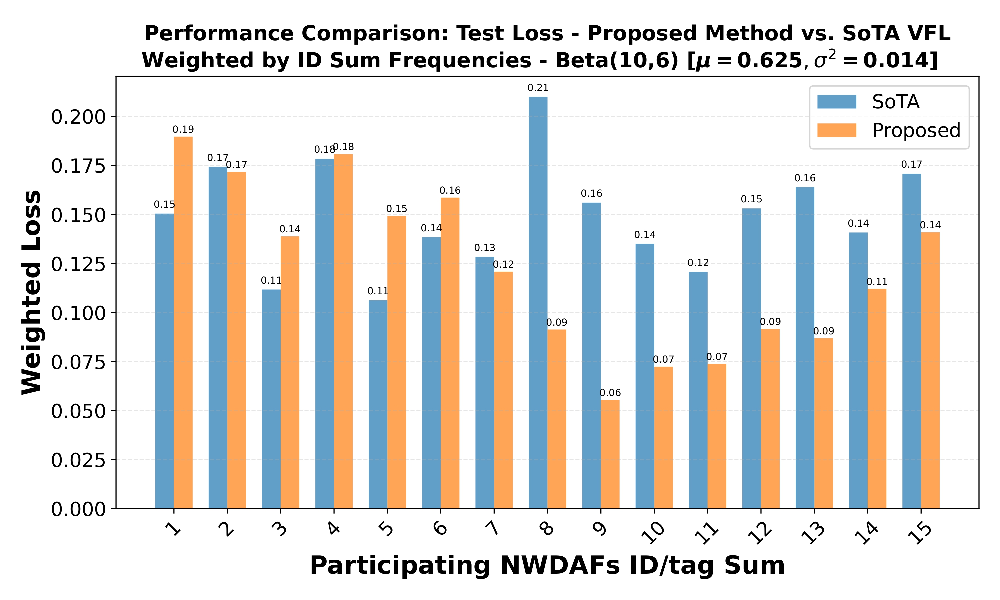
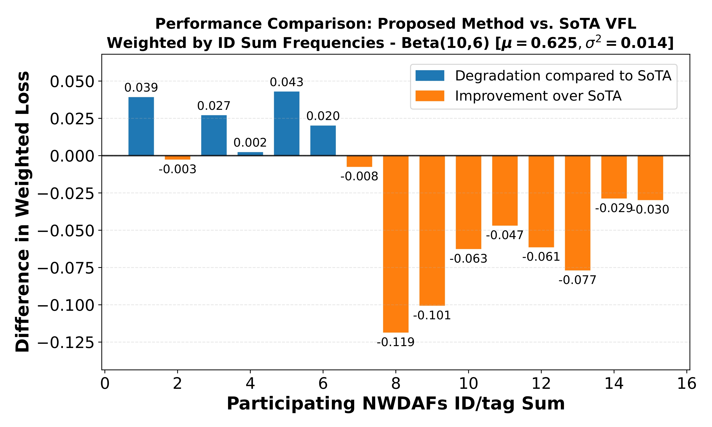

# Reliable Vertical Federated Learning @ CN


Our algorithm is built upon the [Flower Framework](https://flower.ai/), which currently only supports Horizontal Federated Learning (HFL), to demonstrate Vertical Federated Learning capabilities. We'll be using the factory dash video dataset to train simple regression models to estimate the QoE of an AGV running a dash application in a factory based on other distributed NW measurements readings. The dataset can be found in the file "final_raw_dataset_refined_tested.csv".


This version of the code does not support CUDA acceleration but runs efficiently on most CPU architectures.


## Reference

If you find this work useful in your research, please consider citing our related paper:
```
@misc{mestoukirdi2025reliableverticalfederatedlearning,
      title={Reliable Vertical Federated Learning in 5G Core Network Architecture}, 
      author={Mohamad Mestoukirdi and Mourad Khanfouci},
      year={2025},
      eprint={2505.15244},
      archivePrefix={arXiv},
      primaryClass={cs.LG},
      url={https://arxiv.org/abs/2505.15244}, 
}
```
## Project Setup and Installing Dependencies

Start by cloning the example project and installing the dependencies using the `requirements.txt` file.


## Dataset

The dashing factor v2 dataset  is  used to predict the QoE of the AGV based on other `physical`, `mac` and `application` layer features.


The data is stored as a feathers file in `final_raw_dataset_refined_tested.csv`. Post-processing, the dataset contains ~6500 samples with their corresponding labels.


#### Partitioning

In `task.py`, we  partition the data for our "num_clients" clients to mirror real clients where different organizations hold different feature sets. Moreover, we omit useless features from the original dataset and assign the relevant ground truth labels to the label column defined in the `params.yaml` file:

```python

def get_partitions_and_label(params=None, run_id=0,device=None):
    path = params.get("simulation").get("path")
    X, y_label = get_processed_data(path, params)

    
    processed_df, all_keywords = _create_features(X)
    raw_partitions, reliability = _partition_data(processed_df, all_keywords, params, y_label, run_id)

    
    partitions, partitions_test = zip(*[train_test_split(partition, test_size=0.1, random_state=RANDOM_SEED)
                                        for partition in raw_partitions])
    
    partitions, partitions_test = list(partitions), list(partitions_test)  # Convert tuples to lists

    print(f"ylabel is {y_label}")

    # Extract y_label from the first partition only (since it's the same across all)
    if y_label in partitions[0].columns:
        train_ground = partitions[0][y_label].values
        test_ground = partitions_test[0][y_label].values
    else:
        raise ValueError(f"y_label '{y_label}' not found in the first partition!")

    # Drop y_label from all partitions
    for partition in partitions:
        partition.drop(columns=[y_label], inplace=True, errors="ignore")
    for partition in partitions_test:
        partition.drop(columns=[y_label], inplace=True, errors="ignore")

    # Verification for if y_label is removed 
    remaining_columns = [
        i for i, partition in enumerate(partitions) if y_label in partition.columns
    ] + [
        i + len(partitions) for i, partition in enumerate(partitions_test) if y_label in partition.columns
    ]

    if remaining_columns:
        print(f" Warning: y_label '{y_label}' is still present in partitions {remaining_columns}!")


    partitions = [normalize_features(partition) for partition in partitions]
    partitions_test = [normalize_features(partition) for partition in partitions_test]

    print(f"partitions shape = {[np.shape(p) for p in partitions]}")

    return partitions, partitions_test, train_ground, test_ground, len(partitions), reliability


def _partition_data(df, all_keywords, params, y_label, run_id):
    initial_n_clusters = params.get('simulation').get('num_clients') 
    min_feature_per_client = 4 
    if params.get('simulation').get('Optimized'):
        print("*******************************************Optimized Assignment*******************************************")
        clusters, client_reliability, _  = vfl_feature_distribution(df, df[y_label],y_label, initial_n_clusters, min_feature_per_client, run_id=run_id, use_saved=False, save_dir="reliability_lists")
    else:
        print("*******************************************Random Assignment*******************************************")
        clusters, client_reliability = random_feature_distribution(df, initial_n_clusters, min_feature_per_client, run_id=run_id, use_saved=True, save_dir="reliability_lists")


    partitions = []
    
    keywords_sets = clusters
    
    for keywords in keywords_sets:
        selected_columns = set(keywords)  # Only include assigned features
        if y_label in df.columns:
            selected_columns.add(y_label)  
        
        partitions.append(df[list(selected_columns)])
  
    
    # Check for intersection of features across partitions to make sure no features are shared among different clients
    all_features = [set(part.columns) - {y_label} for part in partitions]
    for i in range(len(all_features)):
        for j in range(i + 1, len(all_features)):
            intersection = all_features[i] & all_features[j]
            if intersection:
                raise ValueError(f"Feature overlap detected between partitions {i} and {j}: {intersection}")
    
    return partitions, client_reliability

```

#### The partitioning makes use of two possible feature distribution strategies, one we call random, which distributes the features randomly among (n_clusters= num_clients):

```python
def random_feature_distribution(X, n_clusters, min_feature_per_client, run_id, use_saved=False, save_dir="reliability_lists"):
    """Randomly distribute features into clusters without duplication."""
    if not os.path.exists(save_dir):
        os.makedirs(save_dir)
    
    filename = f"client_reliability_{run_id}.pkl" if run_id is not None else "client_reliability_default.pkl"
    filepath = os.path.join(save_dir, filename)
    
    if use_saved and os.path.exists(filepath):
        with open(filepath, 'rb') as f:
            client_reliability = pickle.load(f)
        print(f"Loaded reliability list for run {run_id}: {client_reliability}")
    else:
        client_reliability = list(np.random.rand(n_clusters))  # Generate reliability list with n_clusters elements
        print(f"Generated new reliability list for run {run_id}: {client_reliability}")
        
        with open(filepath, 'wb') as f:
            pickle.dump(client_reliability, f)
        print(f"Saved reliability list to {filepath}")
    
    features = list(X.columns)
    print(f"len features = {len(features)}")
    np.random.shuffle(features)
    print(f'Reliability of users = {client_reliability}')
    
    total_features = len(features)
    min_required_features = n_clusters * min_feature_per_client
    
    if total_features < min_required_features:
        raise ValueError(f"Not enough features ({total_features}) to ensure at least {min_feature_per_client} per client")
    
    cluster_sizes = np.full(n_clusters, min_feature_per_client)
    extra_features = total_features - min_required_features
    
    for i in range(extra_features):
        cluster_sizes[i % n_clusters] += 1  
    
    clusters = []
    start = 0
    for size in cluster_sizes:
        clusters.append(features[start:start + size])  
        start += size
    
    # Verify no duplicate features across clusters
    seen_features = set()
    for cluster in clusters:
        for feature in cluster:
            if feature in seen_features:
                raise ValueError(f"Feature duplication detected: {feature}")
            seen_features.add(feature)
    
    return clusters, client_reliability
```

The second strategy distributes features in a way, such that each client holds a set of features of importance equivelant to its relative reliability compared to the other clients. The feature importance are calculated centrally using a Decision Tree Regressor or can be via Mutual Information analysis (MI). We call this strategy "vfl_feature_distribution":

```python
def vfl_feature_distribution(X, y,y_label, n_clients, min_features_per_client=5,run_id=None, use_saved=False, save_dir="reliability_lists"):
    """
    Distribute features to clients based on PCA importance for VFL.
    
    Args:
    X (pd.DataFrame): The input features.
    y (pd.Series): The target variable.
    n_clients (int): Number of clients.
    min_features_per_client (int): Minimum number of features per client.
    
    Returns:
    tuple: (client_features, client_scores)
    
    """

    if not os.path.exists(save_dir):
        os.makedirs(save_dir)


    filename = f"client_reliability_{run_id}.pkl" if run_id is not None else f"client_reliability_default.pkl"
    filepath = os.path.join(save_dir, filename)

    if use_saved and os.path.exists(filepath):
        with open(filepath, 'rb') as f:
            client_reliability = pickle.load(f)
        print(f"Loaded reliability list for run {run_id}: {client_reliability}")
    else:
        # Generate new reliability list
        alpha = 8
        beta = 2
        client_reliability = list(np.random.beta(alpha, beta, size=n_clients))
        print(f"Generated new reliability list for run {run_id}: {client_reliability}")
        
        with open(filepath, 'wb') as f:
            pickle.dump(client_reliability, f)
        print(f"Saved reliability list to {filepath}")
        
    
    # Calculate feature importance
    model = RandomForestRegressor()
    # Assuming y_label is the name of the column we want to exclude
    X_without_y_label = X.drop(columns = y_label)
    features = list(X_without_y_label.columns)
    model.fit(X_without_y_label, y)
    # feature_importance = calculate_group_mi(features, X_without_y_label, y)


    feature_importance = model.feature_importances_
    importance_df = pd.DataFrame({'Feature': X_without_y_label.columns, 'Importance': feature_importance})

    # let y_label have importance = 0
    importance_df = pd.concat([importance_df, pd.DataFrame({'Feature': y_label, 'Importance': [0]})], ignore_index=True)
    # importance_df = importance_df.sort_values(by='Importance', ascending=False)
    print(f"feature _ importance : {importance_df}")

    print(f'reliability of users = {client_reliability}') 
    client_features = partition_features(features,feature_importance, n_clients,client_reliability, min_features_per_client)
    
    
    return client_features, client_reliability, None 
```
## Models

### Clients Model Class

Each client's model is a neural network designed to operate on a distinct subset
of features held. In this example we use the following local models class : 


```python
class ClientModel(nn.Module):
    def __init__(self, input_size, latent_dim):
        super(ClientModel, self).__init__()
        

        self.encoder1 = nn.Sequential(
            nn.Linear(input_size, 64, bias=False),
            nn.SELU(),
        )
        
        self.encoder2 = nn.Sequential(
            nn.Linear(64, 32, bias=False),
            nn.SELU(),
        )
        
        self.encoder3 = nn.Sequential(
            nn.Linear(32, 16, bias=False),
            nn.SELU(),
        )
        
        self.latent_projection = nn.Sequential(
            nn.Linear(16, latent_dim, bias=False),
        )
        

        self.apply(self._init_weights)
        
    def _init_weights(self, module):
        if isinstance(module, nn.Linear):
            torch.nn.init.kaiming_normal_(module.weight, nonlinearity='linear')  # Kaiming Normal 
            if module.bias is not None:
                torch.nn.init.zeros_(module.bias)  
    
    
    def forward(self, x):
        if not torch.is_tensor(x):
            x = torch.tensor(x, dtype=torch.float32)
        if x.dim() == 1:
            x = x.unsqueeze(0)
            
        e1 = self.encoder1(x)
        e2 = self.encoder2(e1)
        e3 = self.encoder3(e2)
        latent = self.latent_projection(e3)
        
        return latent

```

The `input_size` corresponds to the number of features each client is allocated, and this
model maps those features to a "latent_dim"-dimensional latent space. The outputs are essentially feature embeddings that capture the patterns within each client's data slice. These embeddings are then ready to be sent to the server for further
processing.

## Server Model Class

The server's model acts as the central aggregator in the VFL system. It's also a
neural network but with a slightly different architecture tailored to its role
in aggregating the client models' outputs.

```python
class ServerModel(nn.Module):
    def __init__(self, input_size):
        super(ServerModel, self).__init__()
        

        self.layer1 = nn.Sequential(
            nn.Linear(input_size, 64, bias=False),
            nn.SELU(),

        )
        
        self.layer2 = nn.Sequential(
            nn.Linear(64, 32, bias=False),
            nn.SELU(),
        )
        
        self.layer3 = nn.Sequential(
            nn.Linear(32, 16, bias=False),
            nn.SELU(),
        )
        
        self.output = nn.Sequential(
            nn.Linear(16, 4, bias=False),
            nn.SELU(),
            nn.Linear(4, 1, bias=False)
        )
        
        self.apply(self._init_weights)
    def _init_weights(self, module):
        if isinstance(module, nn.Linear):
            torch.nn.init.kaiming_normal_(module.weight, nonlinearity='linear')  # Kaiming Normal
            if module.bias is not None:
                torch.nn.init.zeros_(module.bias)  # Bias initialized
    
    
    def forward(self, x):
        if not torch.is_tensor(x):
            x = torch.tensor(x, dtype=torch.float32)
        if x.dim() == 1:
            x = x.unsqueeze(0)
            
        x1 = self.layer1(x)
        x2 = self.layer2(x1)
        x3 = self.layer3(x2)
        return self.output(x3)
```

It comprises multiple linear layers that accepts the concatenated outputs from
all client models as its input. The number of inputs to this layer equals the
total number of outputs from the client models (num_clients x latent_dim). After processing
these inputs, the final layer's output is the QoE point prediction.

## Strategy

The strategy we will write to perform the aggregation will is inherited from `FedAvg` flwr strategy. It constitutes the playground of the server functions. 

```python
self.model = ServerModel(sum(self.latent_dim))


self.initial_parameters = ndarrays_to_parameters(
    [val.cpu().numpy() for _, val in self.model.state_dict().items()]
)

self.optimizer = optim.Adam(self.model.parameters(), lr=0.05)
self.scheduler = optim.lr_scheduler.ExponentialLR(self.optimizer, gamma=0.99)  
self.criterion = nn.HuberLoss(reduction='mean',delta=1.5)
self.label = torch.tensor(labels).float().unsqueeze(1)
self.best_model = [param.detach().clone() for param in self.model.parameters()]
```

With `labels` (test and train) and `latent_dim` are given as an argument to the strategy.

We then redefine the `aggregate_fit` method:

###  Overview - aggregate_fit() method
The `aggregate_fit`  aggregates embedding results from multiple clients, performs model training on the server, and prepares gradients to be sent back to clients.


The function serves the following purposes:
- **Aggregates embedding results from multiple clients**
- **Conducts model training on the server side**
- **Computes and distributes gradients back to clients**


```python
def aggregate_fit(
    self,
    rnd,
    results,
    failures,):


        torch.cuda.empty_cache() if torch.cuda.is_available() else None
        # Do not aggregate if there are failures and failures are not accepted
        if not self.accept_failures and failures:
            return None, {}

        embedding_results = [
            torch.from_numpy(parameters_to_ndarrays(fit_res.parameters)[0])
            for _, fit_res in results
        ]

        availability = [
            torch.from_numpy(parameters_to_ndarrays(fit_res.parameters)[1])
            for _, fit_res in results
        ]
        
        order = [
            torch.from_numpy(parameters_to_ndarrays(fit_res.parameters)[2])
            for _, fit_res in results
        ]

        embeddings_aggregated = concatenate_embeddings_by_client_order(embedding_results, order)
        
        total_availability = sum(availability)
        

        embedding_server = embeddings_aggregated.detach().requires_grad_()
        output = self.model(embedding_server)
        
        task_loss = self.criterion(output, self.label)
        

        
        loss_train = task_loss 
        
        if total_availability > 0:
            print(f"availability = {availability}")
            
            self.optimizer.zero_grad()
            
            loss_train.backward()
            
            self.optimizer.step()
            self.scheduler.step()
            
            grads = embedding_server.grad.split(list(self.latent_dim), dim=1)
            np_grads = [grad.detach().cpu().numpy() for grad in grads]
            parameters_aggregated = ndarrays_to_parameters(np_grads)
            del grads

        else:
            print("All clients Failed, failure to update model")
            
            # No need to compute gradients when all clients failed
            with torch.no_grad():
                zero_grads = [torch.zeros_like(embed).cpu().numpy() 
                            for embed in embedding_server.split(list(self.latent_dim), dim=1)]
                parameters_aggregated = ndarrays_to_parameters(zero_grads)
                del zero_grads

        
        self.training_loss.append(task_loss.item())  
        
        metrics_aggregated = {
            "loss_train": task_loss.item(),
            "total_loss": loss_train.item(),
            "available_clients": total_availability
        }
        
        del embedding_server
        del embeddings_aggregated
        del embedding_results
        
        if rnd == self.n_rounds:
            results_dir = Path("_static/results")
            results_dir.mkdir(exist_ok=True)
            if self.optimized:
                np.save(str(results_dir / f"train_results_optimized_{self.n_run}.npy"), self.training_loss)
            else:
                np.save(str(results_dir / f"train_results_not_optimized_{self.n_run}.npy"), self.training_loss)
        
        return parameters_aggregated, metrics_aggregated
    

```

<!-- The aggregate fit is a function responsible of dealing with the embeddings that are received by the clients at each round. Alongside the embeddings, the clients send their ID so that the server concatenate the embeddings in the correct order regardless of the order of transmission and reception of the embeddings by the clients and the server respectively. This function is run by the server during training to perform the forward pass. 
The embeddings received as `np.array`s are first transformed into `tensor`s, before concatenating the "n_clients" embeddings
together. This means that we go from "n_clients" tensors of size `(5067, latent_dim)` to 1 tensor of
size `(5067, latent_dim*num_clients)`. The combined embeddings are then fed through the server model to
get the prediction output. The loss between the predicted label and the ground truth
labels is calculated. Backward propagation is then performed to calculate the
gradients, which are used to update the server model's parameters.

The optimizer updates the server model's parameters based on the calculated
gradients, and the gradients are reset to zero to prepare for the next round of aggregation.

The gradients from the server model's embedding layer are then split according
to the size of the output from each client model (assuming equal size for
simplicity here), ready to be sent back to the respective client models.

**Note again the difference w.r.t HFL:** Here the `aggregate_fit` function returns gradients instead of trained
weights (in contrast to horizental fl case where the server returns the global model weights to clients). This is because, in this setting, sharing gradients allows each
participant to benefit from the collective feedback gathered from the entire
pool of data without the need to align their different feature spaces.

Accordingly, returning `parameters` from the server isn't necessary. However, as said earlier, the server needs to send `gradients` back to clients for them to continue backpropagation and update their local models.
The `Flower` framework's design allows us to use the `aggregate_fit` function for this purpose. Typically, the output of `aggregate_fit` is sent to `Client.evaluate`. We exploit this mechanism by returning gradients instead of `parameters` from `aggregate_fit`.
Consequently, these gradients are transmitted to `Client.evaluate` as if they were `parameters`. This approach explains why we can access gradients from the `parameters` argument in the `Client.evaluate` function, which will be discussed in the next section.

The last thing we have to do is to redefine the `aggregate_evaluate` and `Client.evaluate` functions to
allow distributed evaluation. Initially, flower framework doesnt allow this as its built with HFL in mind. Since the clients here do not hold any labels to compute the test loss locally as in HFL, the clients should use their test data to produce the test embeddings, and then send them to the server so that it can compute the test loss. To allow this kind of communication between the client and the server during evaluation, we tweak the `aggregate_evaluate` and `Client.evaluate` functions to enable clients to trasmit (using `Client.evaluate` function) their test embeddings (via their test data) to the server which is now able to receive those embeddings (via the tweaked `aggregate_evaluate` function) to calculate the test loss during training. -->


### Overview - aggregate_evaluate() method
The `aggregate_evaluate` method is responsible for handling the evaluation process. It processes client-provided test embeddings, evaluates model performance on the server side, and tracks evaluation metrics such as loss and client availability.


This function serves the following objectives:
- **Aggregates embedding results from clients during evaluation phase**
- **Performs model evaluation using test data**
- **Tracks performance metrics (test loss and availability)**
- **Saves evaluation results to disk at the end of training**


```python
    def aggregate_evaluate(
    self,
    server_round,
    results,
    failures):
        self.best = 1
    
        availability_ = []
        order_ = []
        embeddings = []
        for _,j in results:
            embeddings.append(torch.tensor(np.array(json.loads(j.metrics["params"])),dtype=torch.float32))
            availability_.append(j.metrics["availability"])
            order_.append(j.metrics["id"])
        print("test clients availability")
        
        print(f"order = {order_}, availability_ = {availability_}, sum = {sum(availability_)}")
        self.power.append(sum(availability_))
        embedding=concatenate_embeddings_by_client_order(embeddings,order_)
        # embedding=torch.cat(embeddings, dim=1)
        with torch.no_grad(): 
            outputs = self.model(embedding)
            loss_test = self.criterion(torch.squeeze(outputs), torch.Tensor(self.test_label))
        if server_round == 1 or self.min_loss > loss_test.item():
            print(f"self.min_loss = {self.min_loss}")
            torch.save([param.detach().clone() for param in self.model.parameters()],f"model_weights_optimized={self.optimized}_server_{self.n_run}.pth")
            self.best = 0
            self.min_loss = loss_test.item()
        test_loss = {"loss_test": loss_test}
        print(f"test loss = {loss_test}")
        self.test_loss.append(loss_test)
        if server_round == self.n_rounds:
            results_dir = Path("_static/results")
            results_dir.mkdir(exist_ok=True)
            if self.optimized == True:

                np.save(str(results_dir / f"test_results_optimized_{self.n_run}.npy"), self.test_loss)
                np.save(str(results_dir / f"power_results_optimized_{self.n_run}.npy"), self.power)
            else:
                np.save(str(results_dir / f"test_results_not_optimized_{self.n_run}.npy"), self.test_loss)
                np.save(str(results_dir / f"power_results_not_optimized_{self.n_run}.npy"), self.power)
        return   test_loss, {} 
        
```


## Clients Class and Methods

Our `FlowerClient` has two main methods that are quite straight forward.

---
### Overview - fit() method

The `fit` method is responsible for handling the client-side model fitting process in the VFL setup. It trains the model on the client-side dataset, processes the embedding output. The fit function also saves the local clients models upon reception of a low loss-model indication from the server.

This function serves the following objectives:

- Retrieves configuration settings, including conditions for saving the model.
- Trains the model on the client’s local data.
- Generates and processes the embedding results based on model output.
- Handles client availability and reliability during the fitting process.
- Returns embedding results for server-side aggregation.

---

```python
    def fit(self, parameters, config):
        
        best_value = config.get("best", 1.0)  # Default to 1.0 if not present
        
        if best_value == 0:
            print(f"Client {self.cid} saving model")
            torch.save([param.detach().clone() for param in self.model.parameters()],f"model_weights_optimized={self.optimized}_client_{self.cid}_n_run_{self.n_run}.pth")

        prob = torch.rand(1).item()
        available = self.power if prob <= self.reliability else 0
        
        self.optimizer.zero_grad()
        self.embedding = self.model(self.train)
        if not self.embedding.requires_grad:
            self.embedding.requires_grad_(True)
        if available == 0:
            with torch.no_grad():
                self.embedding = torch.zeros_like(self.embedding)
        
        embedding_np = self.embedding.detach().cpu().numpy()
        result = [embedding_np, available, int(self.cid)]

        return result, len(self.train), {}
```


### Overview - evaluate() method

The `evaluate()` method handles the evaluation process on the client side in the VFL setup. It serves two main purposes: receiving gradients from the server for model updates and forwarding the test data through the local model to produce embeddings, which are then sent back to the server.

This function serves the following objectives:

- Receives gradients from the server and backpropagates them through the local model.
- Performs a forward pass on the test dataset to generate test embeddings.
- Converts the generated embeddings into a format suitable for transmission back to the server (using JSON serialization).
- Tracks client availability and returns evaluation results for server-side aggregation.
---
```python
    def evaluate(self, parameters, config) -> Optional[Tuple[float, Dict[str, List]]]:
        # Determine client availability based on reliability
        prob = torch.rand(1).item()
        available = self.power if prob <= self.reliability else 0
        
        self.model.zero_grad()
        

        

        client_gradients = torch.from_numpy(parameters[int(self.cid)])
        
        if available > 0:
                # Backpropagate with received gradients
                self.embedding.backward(client_gradients)
                # Update model parameters
                self.optimizer.step()
        torch.save([param.detach().clone() for param in self.model.parameters()],
           f"weights_optimized={self.optimized}_client_{self.cid}_n_run_{self.n_run}.pth")

                with torch.no_grad():
            self.embedding_test = self.model(self.test)

            
            # Zero out embeddings if client is unreliable
        if prob > self.reliability:
            self.embedding_test = torch.zeros_like(self.embedding_test)
        
        embedding_np = self.embedding_test.detach().cpu().numpy()
        json_embedding_str = json.dumps(embedding_np.tolist())
        
        del self.embedding_test
        
        return 0.0, len(self.test), {
            "params": json_embedding_str, 
            "availability": available,
            "id": int(self.cid)
        }


```


## Starting the simulation

Putting everything together, to start our simulation we use the following
function `simulation.py` to run the simulation upon configuring the training process:

```python
    
    # Start Flower server
    results = fl.simulation.run_simulation(
        client_app=client_app,
        server_app = server_app,
        num_supernodes=n,
    );
```


### Simulation Config

To choose the number of clients, monte-carlo runs, latent_dim, feature distribution strategy (optimized or SoTA -- optimized = True or optimized = False respectively --), you have to access the `params.yaml` file in the directory and assign those variables accordingly. 

To run the simulations use the `simulation.py`  file.

 
## Results

The results are stored in the "_static/results_final_[a,b]" directory, with a and b representing the Beta distribution parameters configured in the `params.yml` file. These results are saved as .npy files.
You can view visualizations of the results by using the `plot.py` function available in each of the results directory. The local client and server models are stored in their respective folders at the project root.

For the optimized feature distribution implementation, result filenames contain the identifier *optimized = True*. Conversely, SoTA implementation results are saved with filenames containing *optimized = False* along with the corresponding Monte Carlo run number.

`Important`: Always begin with the optimized scenario (by setting optimized = True in params.yml) since the SoTA algorithm depends on the same reliability probabilities sampled  by the optimized scenario in each run to ensure fair performance comparison. The reliability probabilities sampled during simulations are saved in their designated folder at the root directory.


Below is a plot showing the average test loss of two models trained with client unreliability patterns. The results compare our proposed solution to the random feature distribution strategy. For a detailed explanation of how client unreliability is represented in the figures, please refer to our paper [link].






## Contributing
Contributions are welcome! Please feel free to submit a Pull Request.
## License
This project is licensed under the BSD-3-Clause license - see the LICENSE file for details.

---

Built and maintained by [Mohamad Mestoukirdi](https://github.com/Mestou) @MERCE France. Feel free to reach out with any questions or suggestions!


